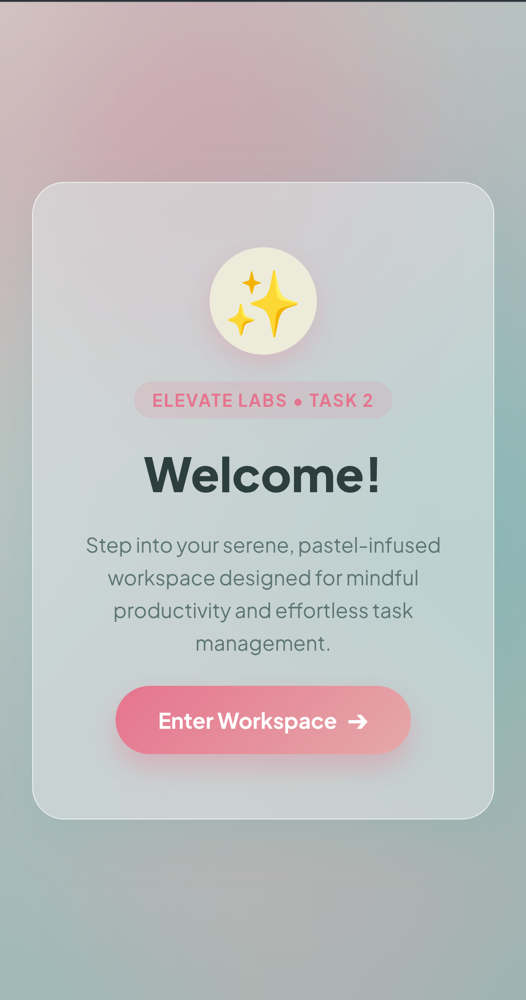
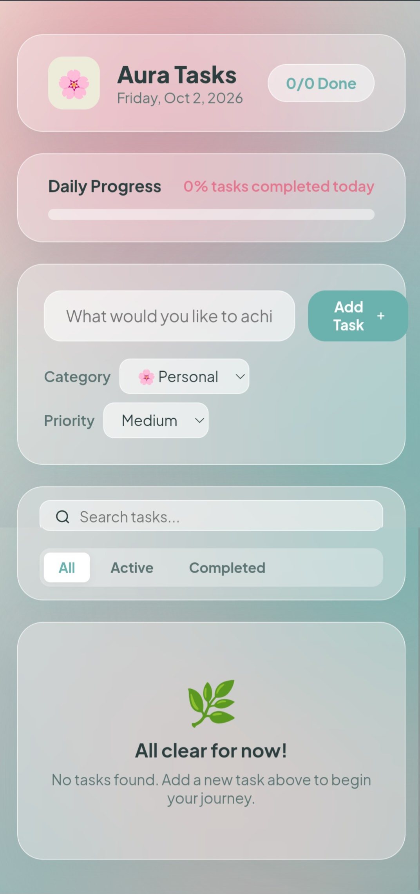

# 🌸 Aura Tasks — Pastel Glassmorphic Workspace

A modern, high-aesthetic To-Do web application featuring a welcome screen overlay, pastel glassmorphism UI, real-time productivity analytics, categories, priority tags, search/filter controls, and persistent `localStorage`.

Built for **Task 2** of the **Elevate Labs Web Development Internship**.

---

## 🔗 Live Demo & Links

* **Live Workspace:** [https://tethi04.github.io/aura-tasks-todo-app/](tethi04.github.io/elevate-web-development-task-2/)
* **GitHub Repository:** [https://github.com/Tethi04/aura-tasks-todo-app](https://github.com/Tethi04/aura-tasks-todo-app)

---

## 📸 Previews

### 1. Welcome Screen


### 2. Main Workspace Overview


---

## ✨ Features

* **Welcome Screen Overlay:** An interactive entrance screen offering a serene transition into the workspace.
* **Pastel Glassmorphic Styling:** Custom glass translucent backdrop filters, soft radial background blobs, and a refined pastel color palette.
* **Dynamic Task CRUD:** Add, complete, toggle, and delete tasks instantly without page reloads.
* **Real-time Analytics:** Daily progress bar and dynamic percentage score reflecting task completion.
* **Categories & Priorities:** Tag tasks with custom categories (*Personal, Study, Creative, Code*) and priority levels (*Low, Medium, High*).
* **Search & Filter System:** Filter tasks by status (*All, Active, Completed*) or search in real-time with string match highlighting.
* **Local Persistence:** Automatic `localStorage` synchronisation to retain state across sessions.
* **Mini Celebrations:** Lightweight, custom confetti animation on task completion.

---

## 🎨 Color Palette Specifications

The design tokens strictly incorporate the following pastel theme:

| Color Name | Hex Code | Usage |
| :--- | :--- | :--- |
| **Veranda Blue** | `#6BB1AD` | Primary Accents, Active Buttons, Checkboxes |
| **Sky Cloud** | `#A7BCBD` | Radial Mesh Blobs, Secondary Borders |
| **Lychee** | `#EDECDB` | Base Card Backgrounds, Icon Badges |
| **Melon** | `#E5A9A9` | Background Accent Blobs, Medium Priority |
| **Cupid Pink** | `#E6748E` | Primary Gradient CTA, High Priority, Badges |

---

## 🛠️ Tech Stack & Concepts Covered

* **HTML5:** Semantic markup, form controls, accessibility attributes.
* **CSS3:** Custom properties (`:root`), Flexbox, CSS Grid, glassmorphism (`backdrop-filter`), keyframe animations.
* **Vanilla JavaScript (ES6+):** DOM selection & manipulation, Event Listeners, State Management, `localStorage` API, Array methods (`filter`, `map`, `unshift`).

---

## 📁 Repository Structure

```text
aura-tasks-todo-app/
├── index.html       # HTML5 App structure & semantic templates
├── style.css        # Pastel Glassmorphic theme & layout design tokens
├── script.js        # Vanilla JS logic, state updates & DOM handling
├── README.md        # Comprehensive task documentation
└── assets/          # Application preview screenshots
```

---

## 👤 Author

* **Tethi Biswas**
* **GitHub:** [@Tethi04](https://github.com/Tethi04)
* **Project:** Elevate Labs Web Development Internship — Task 2
